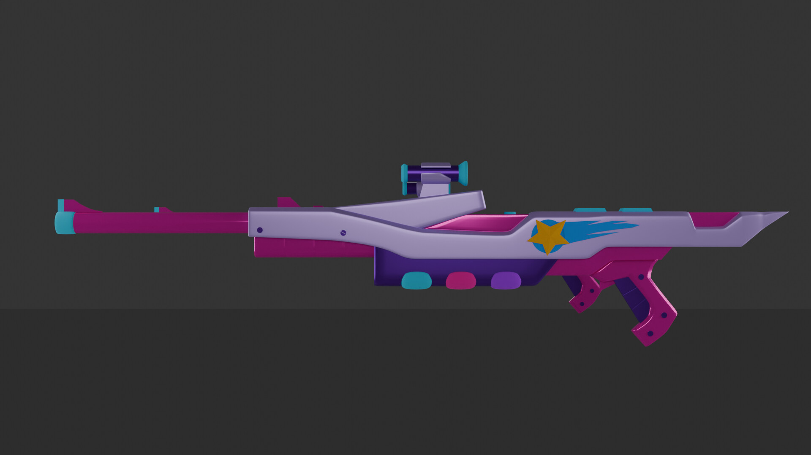

# 🖥️ 3D Modeling Portfolio

This folder contains a curated selection of my 3D modeling projects, focused on detailed weapons from League of Legends skins.

# Disclaimer / Notice

All 3D models presented here are fan-made recreations inspired by existing in-game skins from *League of Legends*.  
These works are strictly for personal portfolio use and educational purposes only.

I do not claim any ownership of the original characters, skins, or intellectual property.  
The intent is to demonstrate my 3D modeling skills by accurately replicating detailed references.

If any rights holders have concerns, please contact me to discuss appropriate actions.

Thank you for understanding.

---

## 🔹 Staff of Veigar — Final Boss Skin  
  
A detailed 3D model of Veigar’s staff from his Final Boss skin, highlighting intricate shapes and glowing effects.

---

## 🔹 Caitlyn’s Weapon — Arcade Skin (Front & Back)  
  
  
High-poly model showing the front and back views of Caitlyn’s weapon from the Arcade skin line.

---

## 🔹 Shen’s Sword — Thunder Blade Skin  
  
Replica of Shen’s sword from the Thunder Blade skin, emphasizing clean edges and sharp details.

---

## 🔹 Fizz’s Scepter — Lucifizz Skin (Little Devil Fizz)  
  
Model of Fizz’s scepter, capturing the playful yet devilish design from the Little Devil Fizz skin.

---

## 🔹 Pyke’s Dagger — Ashen Knight Skin  
  
Detailed dagger model from Pyke’s Ashen Knight skin, focusing on metallic textures and wear.

---

## 🔹 Riven’s Sword — Arcade Skin  
  
Stylized 3D model of Riven’s sword from the Arcade skin, showcasing vibrant colors and dynamic shapes.

---

> **Tools used:** Blender

> Created by Gabriele "Nyxari" Zoltowski | 2024
---
