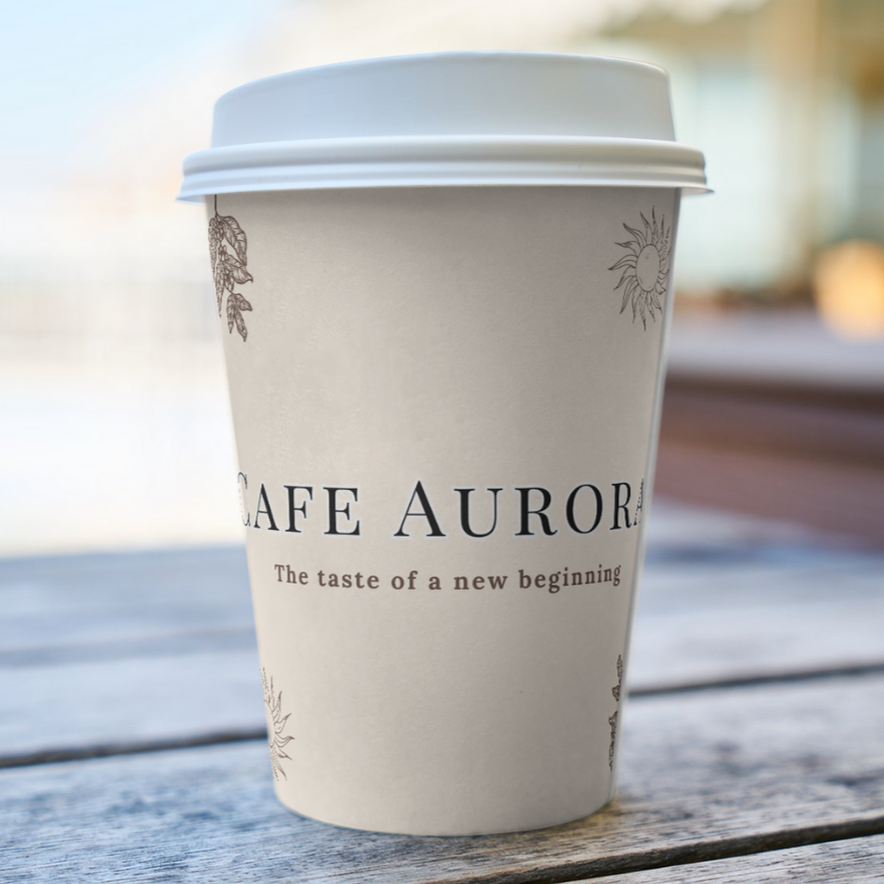
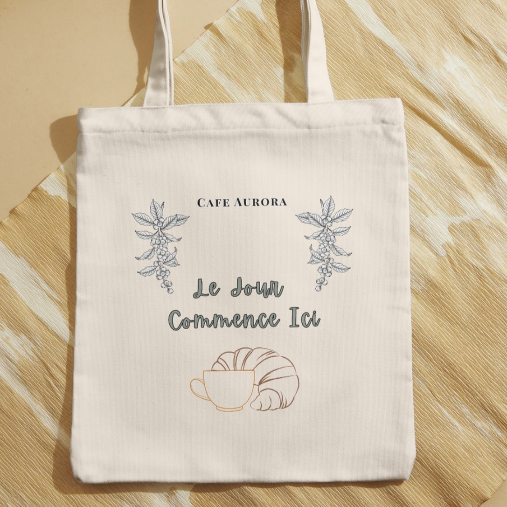

# ☕ Café Aurora

**Café Aurora** is a fictional branding project that combines warmth, elegance, and a nostalgic atmosphere.  
This design explores earthy tones, a handwritten type treatment, and cozy visuals inspired by sunrises and quiet mornings.

---

### 🎨 Brand Palette & Typography  
A warm palette paired with a vintage-inspired serif and a script font to add a human touch.

---

### 🔖 Final Logo

---

### 🧾 Business Card  
**Front**  
  
**Back**  

---

### 🥤 Branded Cup Mockup

---

### ♻️ Ecobag Mockup

---

> **Tools used**: Canva, Photoshop, Krita 
> **Created by Gabriele "Nyxari" Zoltowski | 2025**

