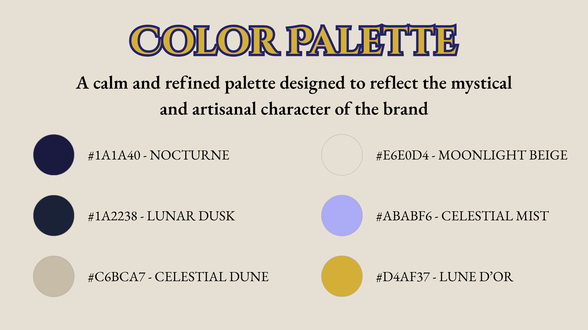
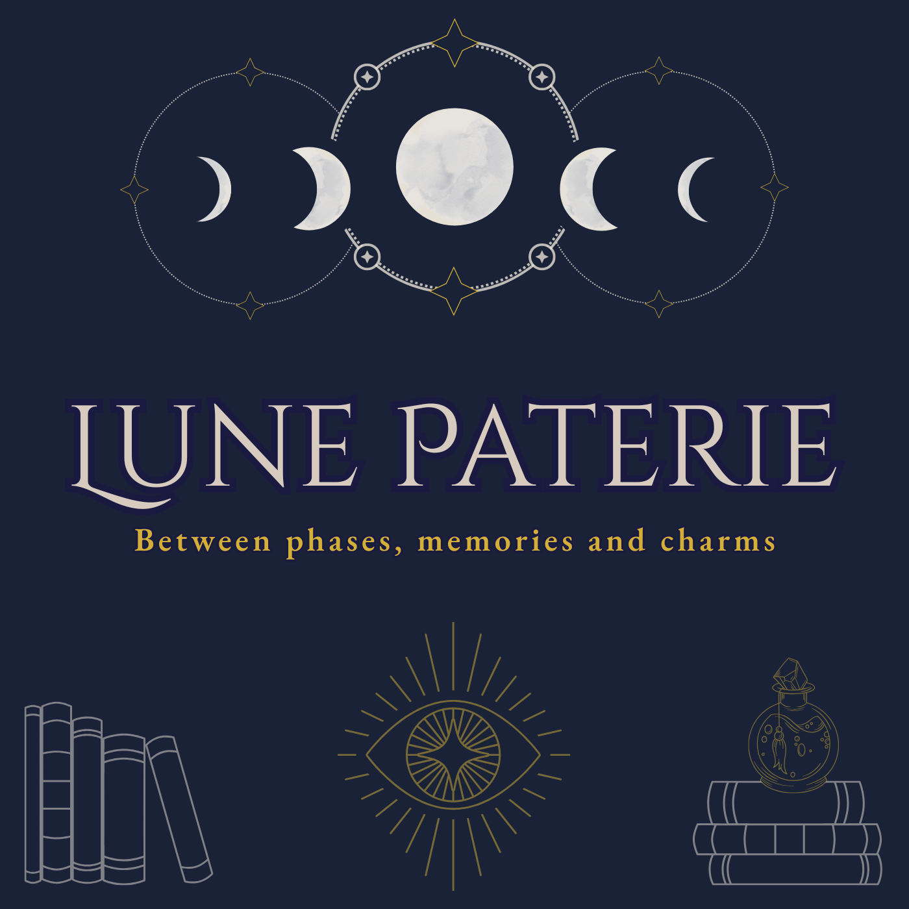
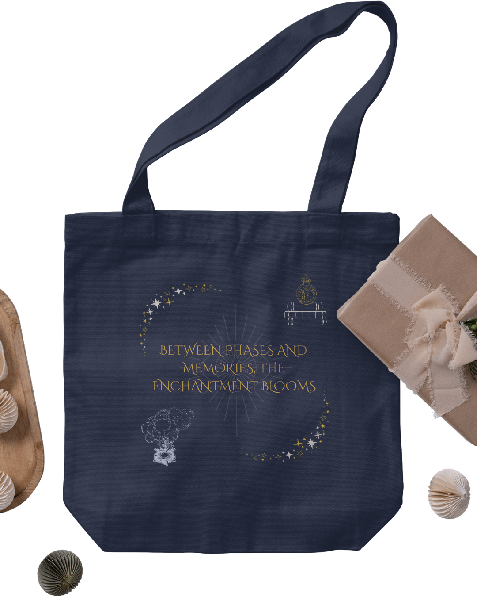

# 🌙 Lune Papeterie

**Lune Papeterie** is a mystical stationery brand built around lunar aesthetics and subtle esoteric elements.  
The project explores elegant minimalism, symbolic visuals, and a muted yet magical color palette.

---

### 🎨 Brand Palette & Typography  
Soft gradients, dusty tones, and a refined font pairing with a spiritual undertone.

---

### 🔮 Final Logo

---

### 🧾 Business Card  

  

---

### 🕯️ Candle Label Mockup

---

### 📓 Notebook Design

---

### ♻️ Ecobag Mockup

---

> **Tools used**: Photoshop, Krita, Canva

> **Created by Gabriele "Nyxari" Zoltowski | 2025**
