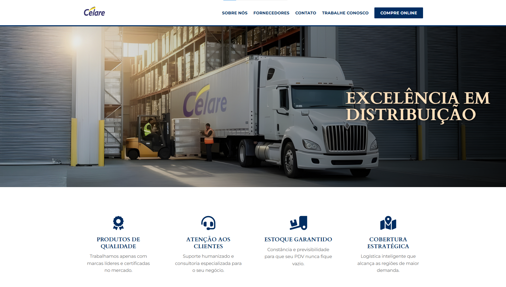
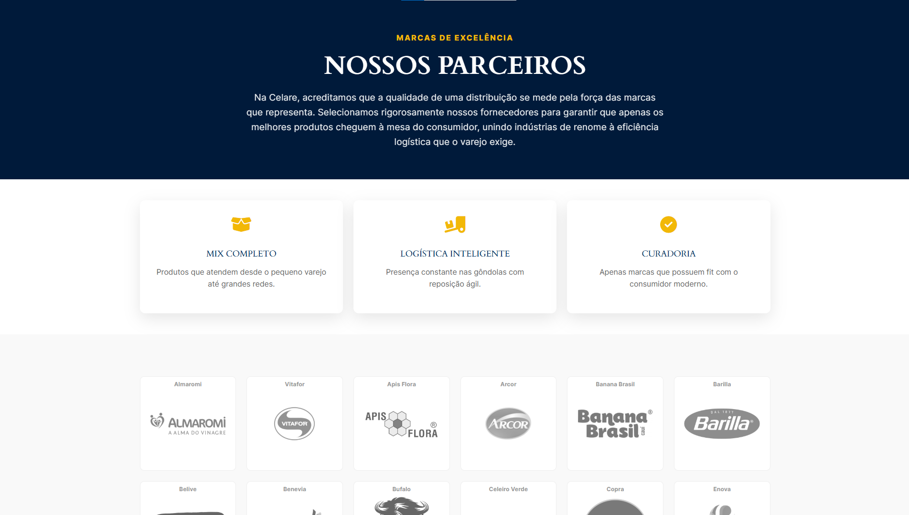

# 🌿 Celare Web Site

**Celare** is an interactive institutional website developed for a food distribution company that bridges the gap between industries and retail. 

The project focuses on a seamless user experience, clean layouts, and dynamic elements to effectively showcase the company's logistics authority and corporate values.

---

### 🔗 Live Project
👉 [Click here to visit the live website](https://www.celare.com.br) *(Available in Portuguese / PT-BR)*

---

### 🖥️ Desktop Interface
A glimpse of the clean typography, structured sections, and modern layout designed for high-resolution screens.

---

### 📱 Responsive & Mobile Design
The interface adapts perfectly to smaller screens, featuring an optimized hamburger menu and a clean, accessible layout for mobile users.

---

### 🎨 Key Features & UI Details
* **Interactive Elements:** Smooth transitions and modern animations that enhance user engagement.
* **Structured Layout:** Optimized 2-column sections and clear content blocks for quick readability.

---

> **Tools & Tech**: Figma, JavaScript, HTML, CSS, WordPress

> **Created by Gabriele "Nyxari" Zoltowski | 2026**
