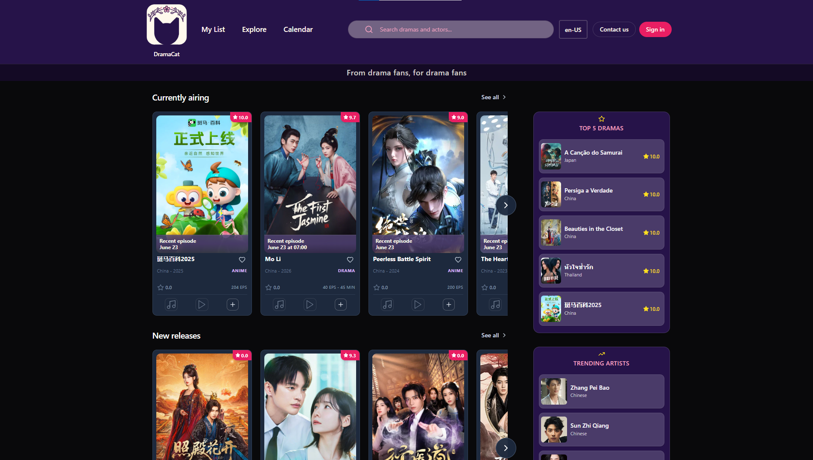
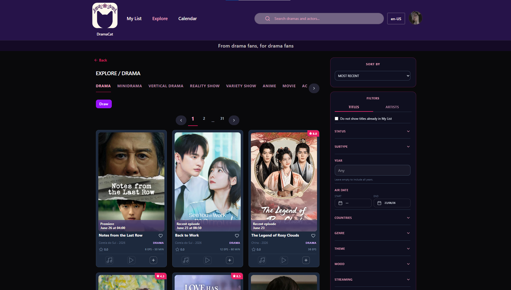

# 🐱 DramaCat

**DramaCat** is a dedicated web application built for Asian drama enthusiasts (K-dramas, C-dramas, and J-dramas). 

The platform allows fans to effortlessly track their watchlists, log their progress, review their favorite shows, and discover new titles—all wrapped in a clean, cat-themed user interface.

---

### 🔗 Live Project
👉 [Click here to visit DramaCat](https://www.dramacat.app)

---

### 🖥️ Dashboard & Watchlist Tracking
A visual overview of the user dashboard where fans can organize what they are currently watching, what they've completed, and what's on their upcoming list.

---

### 🎨 UI/UX & Branding
The project combines a minimalist layout with charming feline elements, vibrant accents, and custom components designed to make cataloging dramas an engaging experience.

---

### 💡 Key Features
* **Progress Tracking:** Easily update which episode you are on so you never lose your place.
* **Smart Discovery:** Explore and filter through a curated database of K-dramas, C-dramas, and J-dramas.
* **Community Reviews:** Share your thoughts, rate shows, and see what other fans are saying.

---

> **Tools & Tech**: React, Vite, Figma

> **Created by Gabriele "Nyxari" Zoltowski | 2026**
